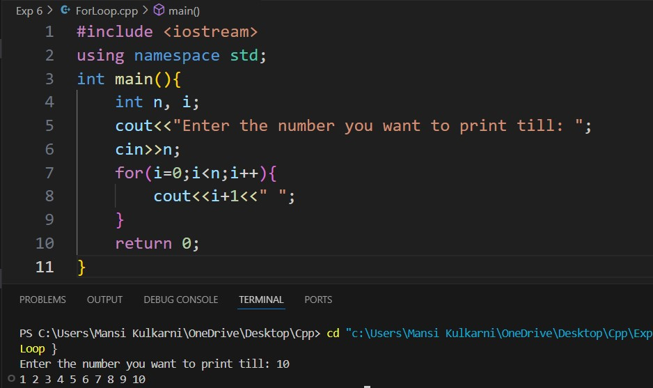
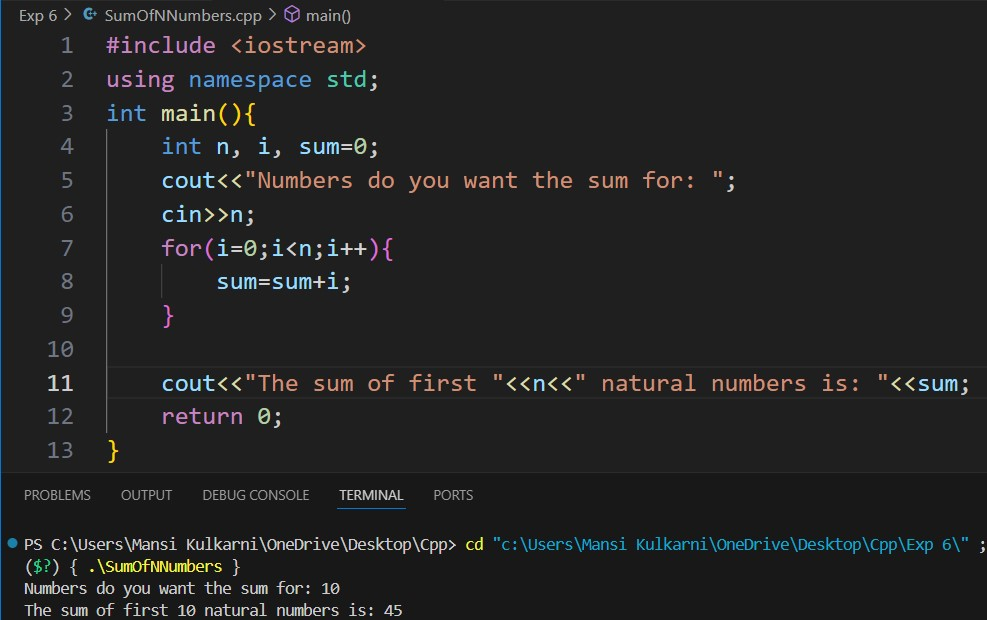
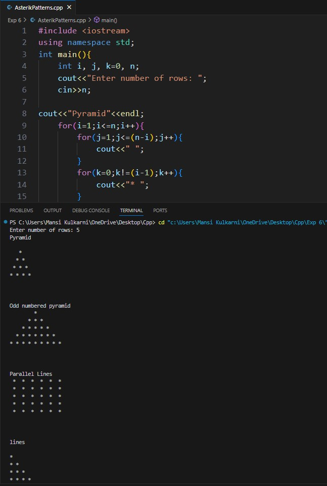
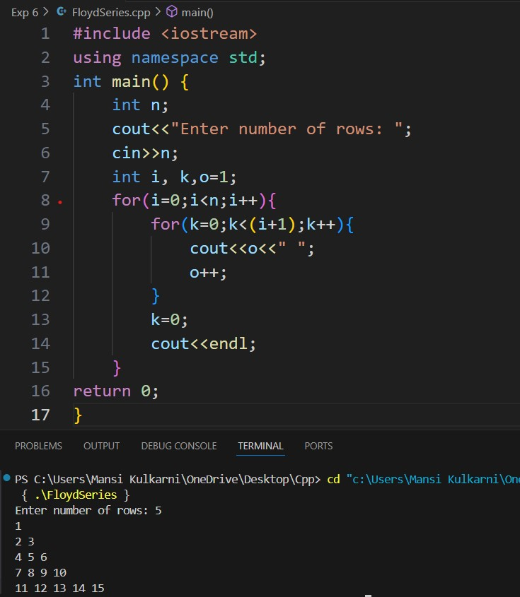
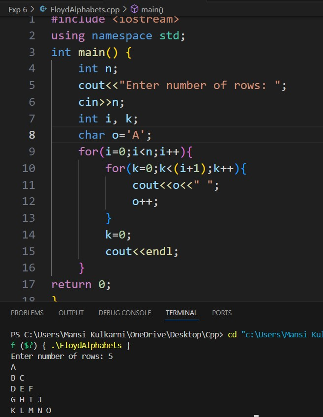
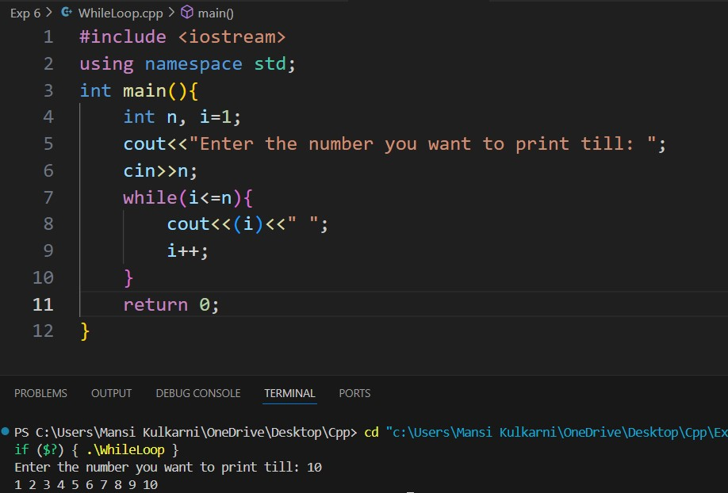
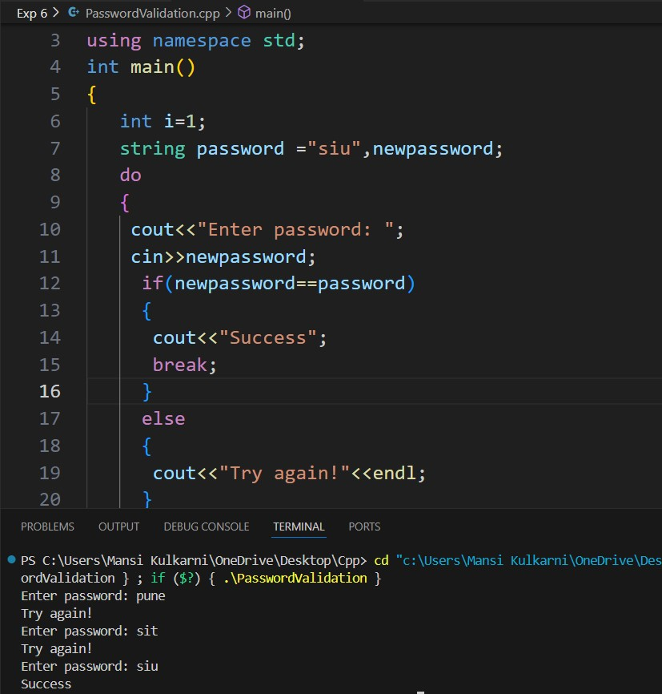

# Experiment 3

### Theory: 
The for loop in C++ is a control structure that allows code to be executed repeatedly based on a condition. It is beneficial to know the number of iterations before entering the loop. The for loop consists of three main components: initialization, condition, and increment/decrement. The loop begins by initializing a variable and then checks the condition before each iteration. If the condition is true, the loop body executes; otherwise, the loop terminates. After each iteration, the increment or decrement operation updates the loop variable.

## Program 1
### Aim: 
Print Numbers from 1 to the end value specified by the user using the for loop. 
### Software used: 
Visual Studio Code
### Output:

### Conclusion:
We learned how to implement a for loop in C++. 

## Program 2
### Aim: 
Calculate the Sum of the First ‘n’ Natural Numbers where ‘n’ is the value entered by the user. 
### Software used: 
Visual Studio Code
### Output:

### Conclusion:
We learned how to add N natural numbers using a for loop in C++. 

## Program 3
### Aim: 
Print Asterik Patterns
### Software used: 
Visual Studio Code
### Output:

### Conclusion:
We printed many different patterns of asterisk and spaces using a for loop in C++. 

## Program 4
### Aim: 
Print Floyd Series
### Software used: 
Visual Studio Code
### Theory:
Floyd's Triangle is a triangular arrangement of consecutive natural numbers, where each row contains an increasing number of integers. The first row contains one number, the second row contains two numbers, the third row contains three numbers, and so on. The numbers are placed in a continuous sequence, starting from 1.
### Output:

Also attached is the extra code output

### Conclusion:
We printed the Floyd series using the for loop in C++. 

## Program 5
### Aim: 
Print Numbers from 1 to the end value specified by the user using a while loop. 
### Software used: 
Visual Studio Code
### Theory:
The while loop in C++ is another control structure used for repetitive tasks. Unlike the for loop, the while loop is used when the number of iterations is not known beforehand. It continuously executes a block of code as long as the specified condition remains true. The condition is evaluated before each iteration, meaning the loop may never execute if the condition is initially false.
### Output:

### Conclusion:
We learned how to implement the while loop in C++. 

## Program 6
### Aim: 
Simple Password Validation using do while loop. 
### Software used: 
Visual Studio Code
### Theory:
The do while loop in C++ is similar to the while loop, with one key difference: the condition is evaluated after the loop body is executed. This guarantees that the loop body will run at least once, even if the condition is false initially. After the execution of the loop body, the condition is checked; if it's true, the loop repeats.
### Output:

### Conclusion:
We checked the user-entered password and allowed it only when entered correctly using a do-while loop in C++. 
